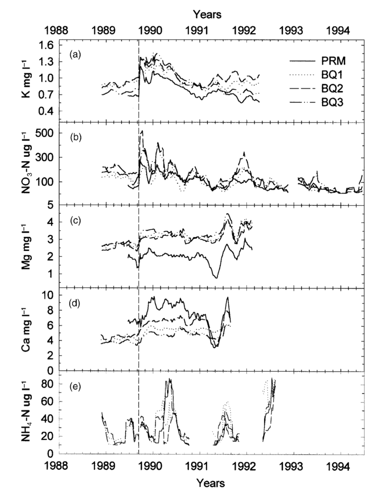

# Hurricane Effects on Stream Chemistry

## Purpose of the Repository
This repository is meant to house all relevant data files and code that's used to recreate a graph from a given article. The repository is essential for storing the most recent versions of all the files and scripts, while staying organized. Below is the figure I attempted to recreate. 

## What's Inside the Repository
Within the repository, there's a "data" file that includes all the raw data from the article. Additionally, the repo stores R scripts that filter, select, and mutate the raw data to produce moving averages and graphs. The code that cleans the data is stored in the "1_clean_data" R file. The code that creates a moving average function is stored in the "R" file, which contains a script called "moving-average". Lastly, the graph can either be found in "docs/paper_files/figure-html", or the paper quarto document, which is a brief scientific paper outlining the background, data, methods, and results of my code and the findings. The original figure (shown above) can be found in the "figs" folder. 

## Accessing the Data
To access the raw data files, there's four csv files within the data folder. In the "scratch" folder, there's two R files that contain scratch code that I used in the beginning. Within the "R" file, there's one R function called "moving-average" that calculates the moving average of any given cleaned dataframe. In the "1_clean_data" file, there's code to read the csv data files in, as well as code that cleans and condenses the amount of data the user is working with, calls the moving average function, and binds and pivots the condensed data to a final dataframe. The information from this file was referenced to create a new csv file ("cleaned_data.csv") that's housed in the "output" folder. The "paper" file contains "paper.qmd" which is a short breakdown of background information, data, methods, and results. The file also contains irrelevant files that allow the quarto document to render. The other two folders, "peer-assessment" and "self-assessment" are markdown files of assessments from my peers and myself, as well as other files that allow these markdown files to run. 

## Authors
Current authors include myself, Kailani Latimer, as well as the authors of R packages I used in the code. This includes 'tidyverse' and 'dplyr'. Additionally, the authors of GitHub profiles and repositories have contributed to the storage of files and organization. Regarding the raw data, authors include Douglas A. Schaefer, William H. McDowell, Frederick N. Scatena, and Clyde E. Asbury. Two of my peers also contributed to these files, Monique Hernandez and Sarah Busby.

## References
My GitHub profile: https://github.com/kailani-boop/kl214final.

My GitHub page: https://kailani-boop.github.io/kl214final/paper.html.

The files for the raw data are found here: https://portal.edirepository.org/nis/mapbrowse?packageid=knb-lter-luq.20.4923064.

A citation for it: 
McDowell, W. and International Institute of Tropical Forestry(IITF), USDA Forest Service.. 2024. Chemistry of stream water from the Luquillo Mountains ver 4923064. Environmental Data Initiative. https://doi.org/10.6073/pasta/f31349bebdc304f758718f4798d25458 (Accessed 2026-08-24).